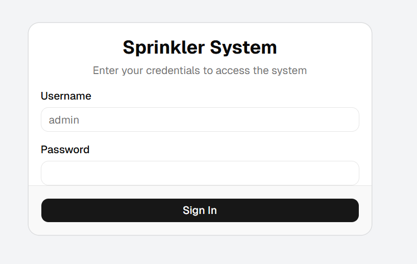
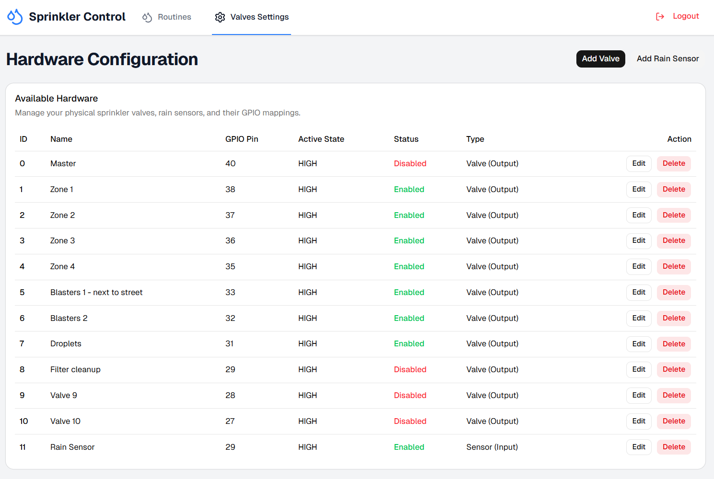
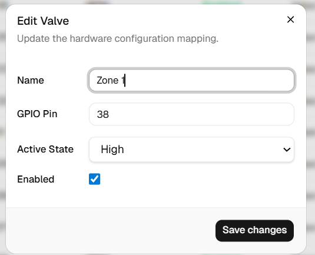
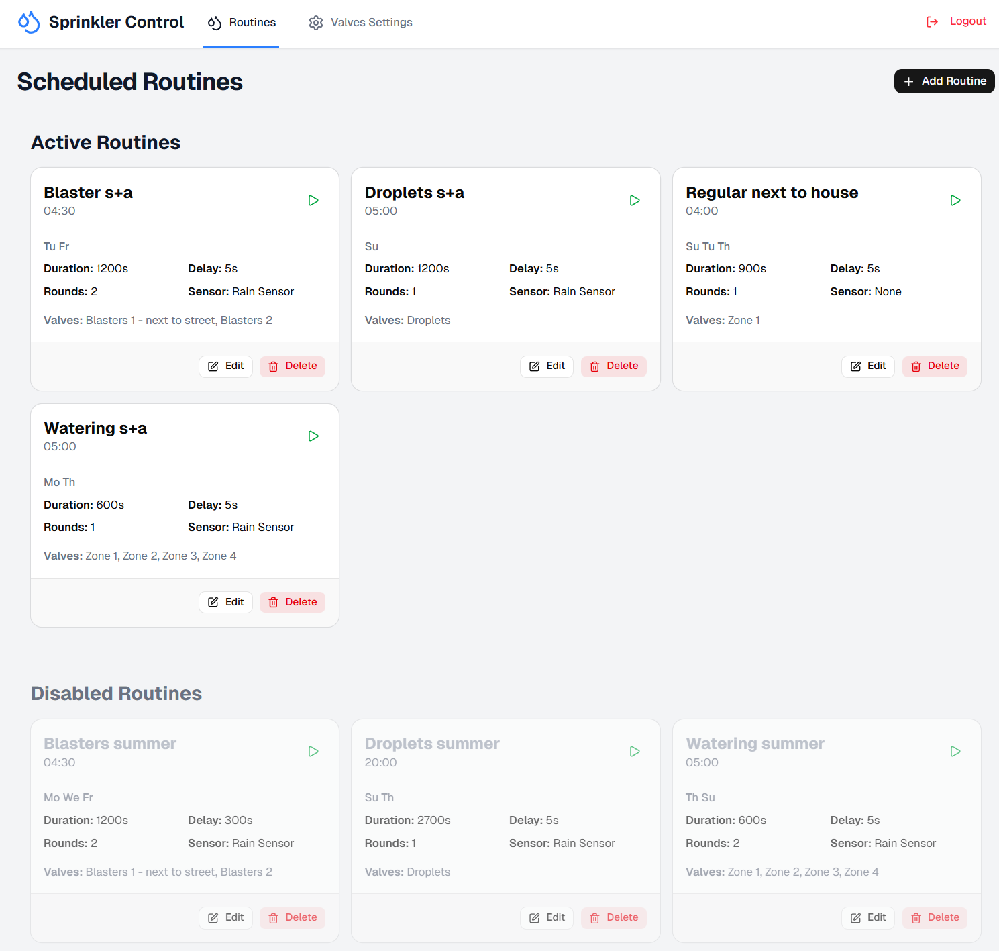
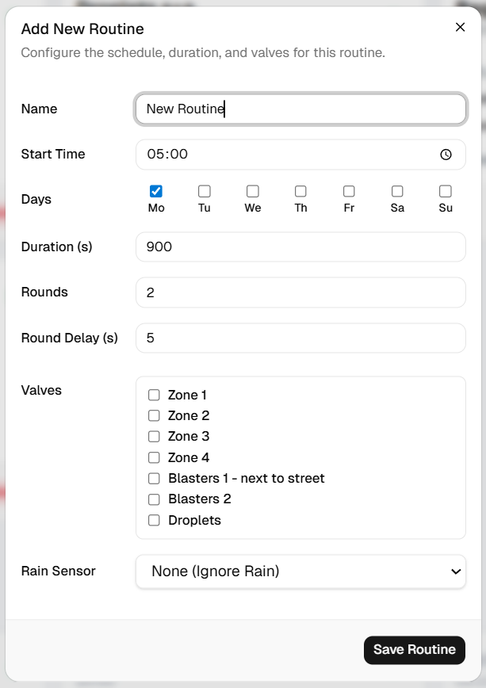
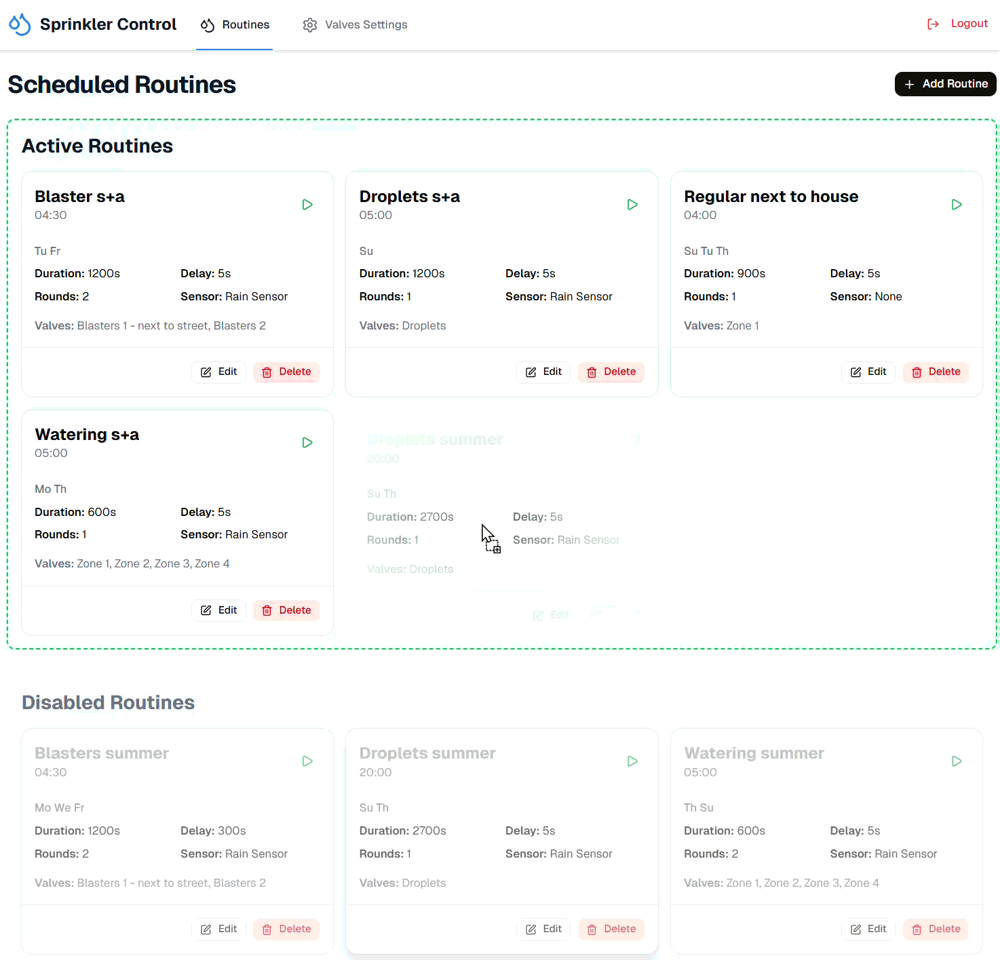
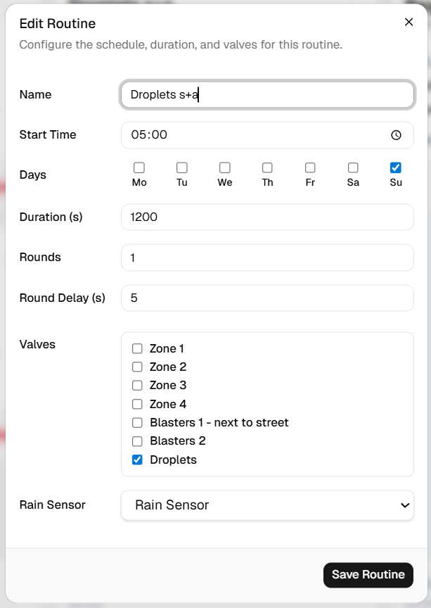

# Jetson Sprinkler System - User Manual

A web-based sprinkler control system for NVIDIA Jetson Nano with automated scheduling and manual control.

## Table of Contents

- [Getting Started](#getting-started)
- [Logging In](#logging-in)
- [Managing Valves](#managing-valves)
- [Creating Routines](#creating-routines)
- [Managing Routines](#managing-routines)
- [Troubleshooting](#troubleshooting)

---

## Getting Started

### Accessing the Application

1. Open your web browser
2. Navigate to: `http://192.168.50.102:5173`
3. You will see the login page

### System Requirements

- NVIDIA Jetson Nano with Docker installed
- Network connection to the Jetson Nano
- Modern web browser (Chrome, Firefox, Safari, Edge)

---

## Logging In



**Default Credentials:**
- **Username:** `admin`
- **Password:** `admin`

> ⚠️ **Security Note:** Change the default password in production by modifying the `ADMIN_PASSWORD` environment variable in `docker-compose.yml`

1. Enter your username and password
2. Click **Login**
3. You will be redirected to the Dashboard

---

## Managing Valves

The Settings page allows you to configure your sprinkler valves.

### Accessing Valve Settings

1. Click **Settings** in the navigation menu
2. You will see a list of all configured valves



### Valve Configuration Fields

Each valve has the following properties:

- **ID:** Unique identifier for the valve
- **Name:** Custom name for easy identification (e.g., "Front Lawn", "Garden Bed 1")
- **GPIO Pin:** Physical GPIO pin number on the Jetson Nano
- **Active State:** `HIGH` or `LOW` - determines how the valve is activated
- **Status:** `Enabled` or `Disabled` - whether the valve is active
- **Type:** `Output` (valve) or `Input` (rain sensor)

### Editing a Valve



1. Click the **Edit** button next to the valve you want to modify
2. Update the valve properties:
   - **Name:** Give it a descriptive name
   - **GPIO Pin:** Set the correct GPIO pin number
   - **Active State:** Select `HIGH` or `LOW`
   - **Enabled:** Check to enable, uncheck to disable
   - **Is Input:** Check if this is a rain sensor (input), leave unchecked for valves (output)
3. Click **Save Changes**

### Valve Status

- **Enabled (Green):** Valve is active and can be used in routines
- **Disabled (Red):** Valve is inactive and will be skipped

> 💡 **Tip:** Only enabled valves will appear in the routine creation dialog

---

## Creating Routines

Routines are automated schedules that control when and how your sprinklers run.

### Accessing the Dashboard

1. Click **Dashboard** in the navigation menu
2. Click the **Add Routine** button



### Creating a New Routine



1. Click **Add Routine**
2. Fill in the routine details:

   **Basic Information:**
   - **Routine Name:** Give your routine a descriptive name (e.g., "Morning Lawn Watering")
   - **Start Time:** Set the time when the routine should run (24-hour format)

   **Schedule:**
   - **Days:** Select which days the routine should run
     - Click the checkboxes for: Mo, Tu, We, Th, Fr, Sa, Su
     - You can select multiple days

   **Watering Settings:**
   - **Duration (seconds):** How long each valve should run (e.g., 900 = 15 minutes)
   - **Rounds:** How many times to repeat the watering cycle
   - **Round Delay (seconds):** Pause between rounds (default: 5 seconds)

   **Valve Selection:**
   - Check the boxes next to the valves you want to include
   - Only enabled valves will appear in the list

   **Rain Sensor (Optional):**
   - Select a rain sensor if configured
   - If rain is detected, the routine will be skipped

3. Click **Save Routine**

### Example Routine

**"Morning Lawn Watering"**
- Start Time: `06:00`
- Days: `Mo, We, Fr` (Monday, Wednesday, Friday)
- Duration: `900` seconds (15 minutes)
- Rounds: `2`
- Round Delay: `5` seconds
- Valves: `Front Lawn`, `Side Yard`
- Rain Sensor: `Rain Sensor 1`

This routine will water the front lawn and side yard for 15 minutes, twice, every Monday, Wednesday, and Friday at 6:00 AM, unless rain is detected.

---

## Managing Routines

### Viewing Routines

The Dashboard displays all your routines in two sections:

- **Active Routines:** Enabled routines that will run on schedule
- **Disabled Routines:** Routines that are paused and won't run

### Enabling/Disabling Routines with Drag and Drop



You can easily enable or disable routines by dragging them between sections:

**To Disable a Routine:**
1. Click and hold on an active routine card
2. Drag it down to the **Disabled Routines** section
3. The section will highlight with a red border
4. Release to drop
5. The routine is now disabled

**To Enable a Routine:**
1. Click and hold on a disabled routine card
2. Drag it up to the **Active Routines** section
3. The section will highlight with a green border
4. Release to drop
5. The routine is now active

> 💡 **Tip:** Disabled routines remain configured but won't run automatically. This is useful for seasonal schedules.

### Editing a Routine



1. Find the routine you want to edit
2. Click the **Edit** button on the routine card
3. Modify the routine settings
4. Click **Save Routine**

### Deleting a Routine

1. Find the routine you want to delete
2. Click the **Delete** button (red trash icon)
3. Confirm the deletion
4. The routine will be permanently removed

---

## Troubleshooting

### Cannot Access the Web Interface

**Problem:** Browser shows "Cannot connect" or "Connection refused"

**Solutions:**
1. Verify the Jetson Nano is powered on
2. Check that Docker containers are running:
   ```bash
   docker-compose ps
   ```
3. Restart the containers if needed:
   ```bash
   docker-compose restart
   ```
4. Verify the correct IP address and port: `http://192.168.50.102:5173`

### Login Failed

**Problem:** "Invalid credentials" error

**Solutions:**
1. Verify you're using the correct username and password
2. Default credentials are `admin` / `admin`
3. Check the `docker-compose.yml` file for configured credentials

### Valves Not Appearing in Routine Creation

**Problem:** No valves show up when creating a routine

**Solutions:**
1. Go to **Settings** and verify valves are configured
2. Ensure valves are **Enabled** (green status)
3. Verify valves are marked as **Output** (not Input/rain sensor)
4. Refresh the page

### Routine Not Running at Scheduled Time

**Problem:** Routine doesn't execute at the configured time

**Solutions:**
1. Verify the routine is in the **Active Routines** section (not disabled)
2. Check the timezone setting in `docker-compose.yml`:
   ```yaml
   - TZ=Europe/Prague
   ```
3. Verify the Jetson Nano system time is correct:
   ```bash
   date
   ```
4. Check backend logs for errors:
   ```bash
   docker-compose logs backend
   ```

### Routine Runs but Valves Don't Open

**Problem:** Routine executes but no water flows

**Solutions:**
1. Verify GPIO pin numbers are correct in valve configuration
2. Check that valves are physically connected to the correct GPIO pins
3. Verify the **Active State** (HIGH/LOW) matches your hardware
4. Check backend logs for errors:
   ```bash
   docker-compose logs backend
   ```
5. Test individual valves manually using the firmware script

### Changes Not Saving

**Problem:** Configuration changes don't persist

**Solutions:**
1. Ensure you clicked **Save** or **Save Changes**
2. Check browser console for errors (F12 → Console tab)
3. Verify backend is running:
   ```bash
   docker-compose ps backend
   ```
4. Check file permissions on configuration files:
   ```bash
   ls -la firmware/src/valves.json
   ls -la firmware/src/schedules.json
   ```

### Time Zone Issues

**Problem:** Routines run at wrong time (UTC instead of local time)

**Solution:**
1. Edit `docker-compose.yml`
2. Update the `TZ` environment variable:
   ```yaml
   environment:
     - TZ=Your/Timezone  # e.g., America/New_York, Europe/London
   ```
3. Restart containers:
   ```bash
   docker-compose restart
   ```

---

## Additional Resources

- **Configuration Files:**
  - Valves: `firmware/src/valves.json`
  - Schedules: `firmware/src/schedules.json`

- **Logs:**
  ```bash
  # View all logs
  docker-compose logs
  
  # View backend logs only
  docker-compose logs backend
  
  # Follow logs in real-time
  docker-compose logs -f
  ```

- **Restart Services:**
  ```bash
  # Restart all services
  docker-compose restart
  
  # Restart specific service
  docker-compose restart backend
  docker-compose restart frontend
  ```

---

## Support

For issues or questions:
1. Check the troubleshooting section above
2. Review the backend logs for error messages
3. Verify your hardware connections and GPIO pin assignments

---

**Last Updated:** March 2026  
**Version:** 1.0
